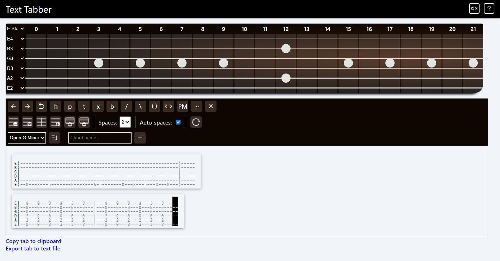

## Text Tabber

An application used to easily write text-based tablature for guitar. Made with React and Sass.

### Notable features

-   UI implemented using React & Sass
-   State management via Redux

## Live Example

[https://text-tabber.com/](https://text-tabber.com/)

## Project Screen Shot

## Installation and Setup Instructions

#### Example:

Clone down this repository. You will need `node` and `npm` installed globally on your machine.

Installation:

`npm install`

To Start Server:

`npm start`

To Visit App:

`localhost:3000/`
